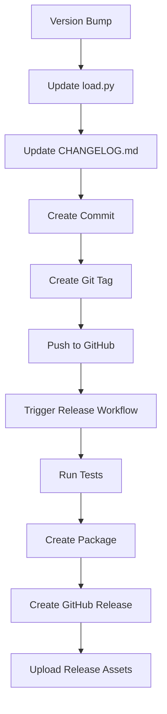

# Release Management Guide

This document describes how to create releases for the EDMC-StreamSource plugin.

## Automated Release Process (Recommended)

### Method 1: Using GitHub Actions (Version Bump + Release)

1. **Go to GitHub Actions**
   - Navigate to your repository on GitHub
   - Click on "Actions" tab
   - Find "Version Bump" workflow

2. **Trigger Version Bump**
   - Click "Run workflow"
   - Select bump type:
     - `patch`: Bug fixes (1.11 → 1.12)
     - `minor`: New features (1.11 → 1.20)
     - `major`: Breaking changes (1.11 → 2.0)
   - Or enter custom version
   - Click "Run workflow"

3. **Automatic Release Creation**
   - The version bump creates a new git tag
   - The tag automatically triggers the release workflow
   - A GitHub release is created with the plugin package

### Method 2: Manual Tag Creation

1. **Update version manually in `load.py`**
   ```python
   VERSION = '1.12'  # Update this line
   ```

2. **Update `CHANGELOG.md`** with new version section

3. **Commit and tag**
   ```bash
   git add load.py CHANGELOG.md
   git commit -m "Bump version to 1.12"
   git tag v1.12
   git push origin main
   git push origin v1.12
   ```

4. **GitHub Actions will automatically create the release**

## Local Release Creation

### Using the Release Script

```bash
# Navigate to project root
cd EDMC-StreamSource

# Create release with version bump
python scripts/create_release.py --version 1.12

# Create release without version bump
python scripts/create_release.py --skip-version-update

# Create release without running tests (faster)
python scripts/create_release.py --skip-tests
```

### Manual Local Process

1. **Update version in `load.py`**
2. **Run tests**
   ```bash
   python test_plugin.py
   python test_performance.py
   ```
3. **Run quality checks**
   ```bash
   flake8 load.py
   mypy load.py --ignore-missing-imports
   ```
4. **Create package**
   ```bash
   mkdir -p dist/EDMC-StreamSource-Release-1.12
   cp load.py README.md LICENSE CHANGELOG.md dist/EDMC-StreamSource-Release-1.12/
   cd dist
   zip -r EDMC-StreamSource-Release-1.12.zip EDMC-StreamSource-Release-1.12/
   ```

## Release Workflow Overview



## Release Package Contents

Each release package includes:

```
EDMC-StreamSource-Release-X.Y.Z/
├── load.py              # Main plugin file
├── README.md           # User documentation
├── LICENSE             # License file
├── CHANGELOG.md        # Version history
├── INSTALL.txt         # Installation instructions
└── VERSION.txt         # Build information
```

## Quality Assurance

All releases automatically include:

- ✅ **Code Linting** (flake8)
- ✅ **Type Checking** (mypy)
- ✅ **Functional Tests** (test_plugin.py)
- ✅ **Performance Tests** (test_performance.py)
- ✅ **Package Integrity** checks

## Release Types

### Patch Releases (X.Y.Z → X.Y.Z+1)
- Bug fixes
- Performance improvements
- Documentation updates
- No new features

### Minor Releases (X.Y.Z → X.Y+1.0)
- New features
- Enhancements
- Backward compatible changes

### Major Releases (X.Y.Z → X+1.0.0)
- Breaking changes
- Major feature additions
- API changes

## Versioning Strategy

We follow [Semantic Versioning](https://semver.org/):

- **MAJOR**: Incompatible API changes
- **MINOR**: Backward compatible functionality additions
- **PATCH**: Backward compatible bug fixes

## Release Checklist

Before creating a release:

- [ ] All tests pass
- [ ] Code quality checks pass
- [ ] CHANGELOG.md is updated
- [ ] Version number is correct in load.py
- [ ] README.md reflects current features
- [ ] No known critical bugs

## Troubleshooting

### Release Workflow Fails
1. Check GitHub Actions logs
2. Verify all required files exist
3. Ensure tests pass locally
4. Check permissions and secrets

### Package Creation Issues
1. Verify all source files exist
2. Check file permissions
3. Ensure clean working directory

### Version Conflicts
1. Check current version in load.py
2. Verify no existing tags with same version
3. Update version number if needed

## Manual Release Recovery

If automated release fails, you can manually create a release:

1. **Download artifacts** from failed GitHub Action
2. **Go to GitHub Releases**
3. **Click "Create a new release"**
4. **Upload the zip file** as an asset
5. **Add release notes** from CHANGELOG.md

## Support

For release process issues:
- Check [GitHub Actions](https://github.com/gOOvER/EDMC-StreamSource/actions)
- Open an issue with "release" label
- Review workflow logs for error details
